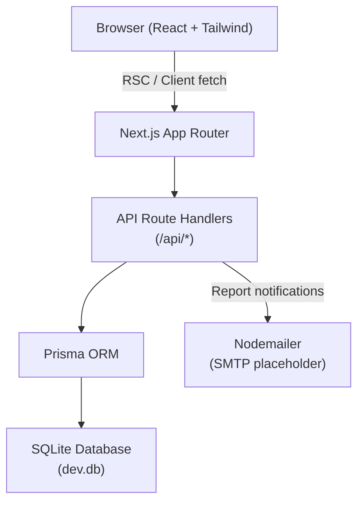

# Design Document: Cal Poly Dining Reviews

## Overview

Cal Poly Dining Reviews is a full-stack web application built for the KiroHacks Hackathon. It lets Cal Poly students browse on-campus dining restaurants, read and submit item-level reviews, search for menu items, and report inappropriate content — all without requiring authentication.

The design prioritizes:
- **Speed to build**: A single Next.js app with API Routes eliminates the need for a separate backend service, keeping the codebase small and deployable in one command.
- **Human-Centered Design**: The UI is mobile-first, accessible (WCAG 2.1 AA), and optimized for the "standing in line" use case.
- **Kiro-native development**: The project uses Kiro specs, hooks, steering files, and MCP to demonstrate the full Kiro workflow.

### Tech Stack

| Layer | Choice | Rationale |
|---|---|---|
| Framework | Next.js 14 (App Router) | Full-stack in one repo; React Server Components for fast page loads; API Routes for backend logic |
| Language | TypeScript | Type safety across frontend and backend |
| Database | SQLite via Prisma ORM | Zero-config, file-based, no external service needed for hackathon |
| Styling | Tailwind CSS | Rapid responsive UI development |
| Email | Nodemailer (SMTP placeholder) | Simple email sending; placeholder config with TODO comment |
| Testing | Vitest + fast-check | Unit/property-based testing |

---

## Architecture

The application follows a **monolithic Next.js architecture** — a single repository containing both the React frontend and the API backend via Next.js Route Handlers.



### Request Flow

1. The browser loads a React Server Component page (e.g., `/restaurants/[id]`).
2. The RSC fetches data directly from Prisma on the server — no round-trip needed for initial render.
3. Interactive actions (submit review, add menu item, report) call API Route Handlers via `fetch`.
4. API routes validate input, write to SQLite via Prisma, and return JSON.
5. The client updates local state optimistically or re-fetches to reflect changes.

### Key Architectural Decisions

- **No separate API server**: Next.js Route Handlers (`app/api/`) serve as the backend. This halves the codebase size for a hackathon.
- **SQLite over PostgreSQL**: No Docker, no connection strings, no external service. The database is a single file (`prisma/dev.db`) committed to the repo for demo purposes.
- **No authentication**: Per Requirement 4, anyone can submit reviews. No session management needed.
- **Optimistic UI for reviews**: After submitting a review, the client appends it to the list immediately while the server write completes in the background, satisfying the "within 5 seconds" requirement.

---

## Components and Interfaces

### Page Structure (App Router)

```
app/
├── page.tsx                          # Home: restaurant list + community feed
├── layout.tsx                        # Root layout: nav, search bar, global styles
├── restaurants/
│   └── [restaurantId]/
│       ├── page.tsx                  # Restaurant page: menu list + Add Menu Item button
│       └── items/
│           └── [itemId]/
│               └── page.tsx          # Menu item page: reviews list + submit review form
├── search/
│   └── page.tsx                      # Search results page
├── feed/
│   └── page.tsx                      # Community review feed
└── api/
    ├── restaurants/
    │   └── route.ts                  # GET /api/restaurants
    ├── restaurants/[restaurantId]/
    │   └── items/
    │       └── route.ts              # GET, POST /api/restaurants/[id]/items
    ├── items/[itemId]/
    │   ├── route.ts                  # GET /api/items/[id]
    │   └── reviews/
    │       └── route.ts              # GET, POST /api/items/[id]/reviews
    ├── reviews/
    │   └── route.ts                  # GET /api/reviews (feed)
    ├── search/
    │   └── route.ts                  # GET /api/search?q=
    └── reports/
        └── route.ts                  # POST /api/reports
```

### UI Components

| Component | Responsibility |
|---|---|
| `SearchBar` | Global search input in the nav; navigates to `/search?q=` on submit |
| `RestaurantCard` | Displays restaurant name and item count on the home page |
| `MenuItemCard` | Displays item name, description, average rating with star display |
| `ReviewCard` | Displays a single review: rating, comment, timestamp, Report button |
| `ReviewForm` | Star rating selector + textarea + submit button |
| `AddMenuItemModal` | Modal with item name input + restaurant dropdown |
| `ReportModal` | Modal with reason textarea + submit button |
| `StarRating` | Reusable star display/input component (1–5) |
| `FeedItem` | Review card variant for the community feed with restaurant/item context |
| `EmptyState` | Reusable "nothing here yet" message component |

### API Interface Contracts

#### `GET /api/restaurants`
Returns all restaurants with item count.
```typescript
Response: Restaurant[]
// Restaurant: { id, name, description, itemCount }
```

#### `GET /api/restaurants/[restaurantId]/items`
Returns all menu items for a restaurant.
```typescript
Response: MenuItem[]
// MenuItem: { id, name, description, restaurantId, restaurantName, averageRating, reviewCount, isUserSubmitted }
```

#### `POST /api/restaurants/[restaurantId]/items`
Adds a new user-submitted menu item.
```typescript
Body: { name: string, restaurantId: string }
Response: MenuItem | { error: string }
```

#### `GET /api/items/[itemId]/reviews`
Returns all reviews for a menu item.
```typescript
Response: Review[]
// Review: { id, rating, comment, createdAt, menuItemId, menuItemName, restaurantName }
```

#### `POST /api/items/[itemId]/reviews`
Submits a new review.
```typescript
Body: { rating: number, comment?: string }
Response: Review | { error: string }
```

#### `GET /api/reviews`
Returns the 50 most recent reviews (community feed).
```typescript
Response: Review[]
```

#### `GET /api/search?q=`
Searches restaurants and menu items by name.
```typescript
Response: { restaurants: Restaurant[], menuItems: MenuItem[] }
```

#### `POST /api/reports`
Submits a report for a review or menu item.
```typescript
Body: { targetType: 'review' | 'menuItem', targetId: string, reason: string }
Response: { success: boolean } | { error: string }
```

---

## Data Models

### Prisma Schema

```prisma
model Restaurant {
  id          String     @id @default(cuid())
  name        String
  description String?
  createdAt   DateTime   @default(now())
  menuItems   MenuItem[]
}

model MenuItem {
  id              String     @id @default(cuid())
  name            String
  description     String?
  restaurantId    String
  restaurant      Restaurant @relation(fields: [restaurantId], references: [id])
  isUserSubmitted Boolean    @default(false)
  createdAt       DateTime   @default(now())
  reviews         Review[]
  reports         Report[]

  @@unique([name, restaurantId])  // Enforces duplicate detection (case-insensitive via app logic)
}

model Review {
  id         String    @id @default(cuid())
  rating     Int       // 1–5 inclusive
  comment    String?   // max 500 chars enforced at API layer
  createdAt  DateTime  @default(now())
  menuItemId String
  menuItem   MenuItem  @relation(fields: [menuItemId], references: [id])
  reports    Report[]
}

model Report {
  id           String    @id @default(cuid())
  reason       String
  createdAt    DateTime  @default(now())
  targetType   String    // 'review' | 'menuItem'
  reviewId     String?
  review       Review?   @relation(fields: [reviewId], references: [id])
  menuItemId   String?
  menuItem     MenuItem? @relation(fields: [menuItemId], references: [id])
  emailSent    Boolean   @default(false)
  emailRetries Int       @default(0)
}
```

### Computed Fields

- **`averageRating`**: Computed at query time using Prisma's `_avg` aggregate on `Review.rating`. Not stored as a column to avoid stale data.
- **`reviewCount`**: Computed via `_count` aggregate.

### Seed Data

The database will be seeded with Cal Poly dining restaurants and representative menu items:

```
Restaurants (examples):
- 19 Metro Station
- Vista Grande
- Poly Eats
- Pony Espresso
- Chumash Dining
- Cerro Vista Dining
- Subway (on campus)
- Jamba Juice (on campus)
```

Each restaurant will have 5–10 seeded menu items with descriptions. Seed script lives at `prisma/seed.ts`.

---

## Correctness Properties

*A property is a characteristic or behavior that should hold true across all valid executions of a system — essentially, a formal statement about what the system should do. Properties serve as the bridge between human-readable specifications and machine-verifiable correctness guarantees.*

### Property 1: Review rating bounds enforcement

*For any* integer value submitted as a review rating, the API SHALL accept it if and only if it is in the range [1, 5] inclusive; values outside this range SHALL be rejected with a descriptive error.

**Validates: Requirements 3.1, 3.5**

### Property 2: Comment length enforcement

*For any* string submitted as a review comment, the API SHALL accept it if and only if its length is ≤ 500 characters; strings exceeding 500 characters SHALL be rejected with a descriptive error.

**Validates: Requirements 3.2, 3.6**

### Property 3: Average rating correctness

*For any* non-empty set of ratings in [1, 5] associated with a menu item, the computed average rating returned by the API SHALL equal the arithmetic mean of all those ratings. This invariant SHALL hold both before and after adding a new review.

**Validates: Requirements 2.3, 3.7**

### Property 4: Duplicate menu item rejection

*For any* restaurant and any menu item name that already exists at that restaurant, submitting a new menu item with the same name (in any combination of upper/lower case) SHALL be rejected; submitting a name that does not match any existing item at that restaurant SHALL succeed.

**Validates: Requirements 9.5**

### Property 5: Search case-insensitivity

*For any* search query string `q` and any restaurant or menu item in the database whose name contains `q` as a substring (ignoring case), that item SHALL appear in the search results; items whose names do not contain `q` (case-insensitive) SHALL NOT appear.

**Validates: Requirements 5.2**

### Property 6: Community feed ordering and size invariant

*For any* number of reviews N in the database, the community feed SHALL return exactly min(N, 50) reviews, and those reviews SHALL be ordered by `createdAt` descending (most recent first).

**Validates: Requirements 6.1**

### Property 7: Report persistence regardless of email outcome

*For any* submitted report, whether the email notification succeeds or fails, the report SHALL be stored in the database with all required fields (reported content, restaurant, reason, timestamp).

**Validates: Requirements 10.3, 10.6**

### Property 8: Review submission round-trip

*For any* valid review payload (rating in [1,5], optional comment ≤ 500 chars), submitting the review via the API and then fetching the menu item's reviews SHALL return a review containing the same rating and comment, associated with the correct menu item.

**Validates: Requirements 3.3, 7.1**

### Property 9: Reviews ordered reverse-chronologically

*For any* menu item with two or more reviews, the reviews returned by the API SHALL be ordered by `createdAt` descending — no review with an earlier timestamp SHALL appear before a review with a later timestamp.

**Validates: Requirements 2.5**

### Property 10: Email notification contains required fields

*For any* submitted report, the email notification body generated by the system SHALL contain the reported content (review text or menu item name), the associated restaurant name, the report reason, and the submission timestamp.

**Validates: Requirements 10.5**

---

## Error Handling

### Validation Errors (4xx)

All API routes validate input before touching the database. Validation errors return HTTP 400 with a JSON body:

```json
{ "error": "Rating must be between 1 and 5" }
```

Validation rules enforced at the API layer:
- `rating`: must be an integer in [1, 5]
- `comment`: must be ≤ 500 characters if provided
- `name` (menu item): must be non-empty after trimming
- `restaurantId`: must reference an existing restaurant
- `reason` (report): must be non-empty after trimming

### Database Errors (5xx)

If a Prisma write fails, the API returns HTTP 500 with a descriptive message. The client displays this to the user (Requirement 7.4). No silent discards.

### Duplicate Detection

The `@@unique([name, restaurantId])` constraint on `MenuItem` provides a database-level guard. The API also performs a case-insensitive pre-check before attempting the insert, returning a 409 Conflict with a human-readable message.

### Email Notification Failures

If Nodemailer fails to send a report notification:
1. The report is already persisted in the database (write happens before email send).
2. The `emailSent` flag remains `false` and `emailRetries` is incremented.
3. A background retry mechanism (simple in-process setTimeout chain, max 3 retries) attempts redelivery.
4. The user receives a success confirmation regardless (Requirement 10.4).

### Not Found (404)

Requests for non-existent restaurants, menu items, or reviews return HTTP 404 with `{ "error": "Not found" }`. The UI renders an `EmptyState` component.

---

## Testing Strategy

### Overview

The project uses a **dual testing approach**:
- **Unit/example tests** for specific behaviors, edge cases, and error conditions
- **Property-based tests** for universal correctness properties across all valid inputs

### Property-Based Testing

**Library**: [fast-check](https://fast-check.dev/) — a mature TypeScript-native property-based testing library.

**Runner**: Vitest (integrates natively with fast-check via `fc.assert`).

**Configuration**: Each property test runs a minimum of **100 iterations** (`numRuns: 100`).

**Tag format**: Each property test is tagged with a comment:
```
// Feature: cal-poly-dining-reviews, Property N: <property_text>
```

**Properties to implement as tests**:

| Property | Test File | What's Generated |
|---|---|---|
| P1: Rating bounds | `tests/api/reviews.property.test.ts` | Random integers (valid and invalid ranges) |
| P2: Comment length | `tests/api/reviews.property.test.ts` | Random strings of varying length |
| P3: Average rating correctness | `tests/lib/ratings.property.test.ts` | Random arrays of ratings in [1,5] |
| P4: Duplicate menu item rejection | `tests/api/menuItems.property.test.ts` | Random item names with case variations |
| P5: Search case-insensitivity | `tests/api/search.property.test.ts` | Random strings with mixed case |
| P6: Feed ordering and size invariant | `tests/api/feed.property.test.ts` | Random sets of reviews (0–200) |
| P7: Report persistence regardless of email | `tests/api/reports.property.test.ts` | Random report payloads with simulated email failures |
| P8: Review submission round-trip | `tests/api/reviews.property.test.ts` | Random valid review payloads |
| P9: Reviews ordered reverse-chronologically | `tests/api/reviews.property.test.ts` | Random sets of reviews with varying timestamps |
| P10: Email notification fields | `tests/lib/email.property.test.ts` | Random report payloads |

### Unit Tests

Unit tests cover:
- `StarRating` component renders correct number of filled stars
- `ReviewForm` shows validation errors for invalid input before submission
- `AddMenuItemModal` disables submit when fields are empty
- `SearchBar` navigates to correct URL on submit
- Seed data integrity (all seeded restaurants and items exist)

### Integration Tests

- End-to-end API route tests using Vitest with an in-memory SQLite database
- Covers: create review → fetch reviews → verify average rating updated
- Covers: submit report → verify DB record → verify email attempted

### Accessibility Testing

WCAG 2.1 AA compliance is validated through:
- Manual testing with keyboard navigation and screen reader (VoiceOver/NVDA)
- `axe-core` integration in Vitest for automated rule checking on rendered components

> Full WCAG validation requires manual testing with assistive technologies and expert accessibility review.
